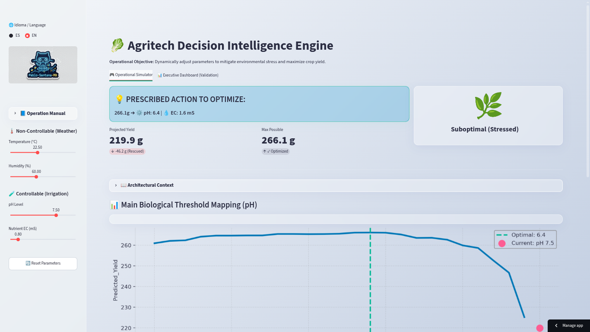

<div align="center">
  <h1>🥬 Agritech Decision Intelligence Engine</h1>
  <p><i>End-to-End Decision Intelligence: From Raw Sensor Data to Mathematical Optimization</i></p>

  <p>
    <a href="#-english-version">🇬🇧 English Version</a> | <a href="#-versión-en-español">🇲🇽 Versión en Español</a>
  </p>

  <a href="https://agritech-decision-engine.streamlit.app/">
    
  </a>
  
  
  
</div>

---

# 🇬🇧 English Version

## 🔬 Abstract / Executive Summary
Modern hydroponic systems generate dense streams of IoT telemetry data, yet the agribusiness sector frequently fails to utilize this information prescriptively. The yield of *Lactuca sativa* (lettuce) suffers a severe non-linear biological decline when the environment deviates from its tolerance threshold. 

This project applies the **Scientific Method** to mathematically model these biochemical interactions. We transition from sensor anomaly imputation, through the training of decision tree ensembles (Random Forest) with Explainable AI (SHAP), culminating in a heuristic optimization engine that prescribes real-time calibrations to maximize yield.

---

## 🧪 Scientific Methodology & Theoretical Framework

### Phase 1: Descriptive Analysis & Data Topology
Prior to any modeling, 4,900 telemetry records were audited to evaluate data quality. 

**Theoretical Framework (Descriptive Statistics):**
To isolate the operational "sweet spots", we utilized Kernel Density Estimation (KDE) to map the probability density function of continuous variables. Outliers indicating sensor failure were isolated using the Interquartile Range ($IQR$) method, where any point outside $[Q_1 - 1.5 \times IQR, Q_3 + 1.5 \times IQR]$ was flagged for multivariate imputation.

<div align="center">
  
</div>
<br>

> **Fig 1. Density and Outlier Topology:** Violin analysis reveals the density distribution of the sensors, capturing the bi-modal or skewed nature of biological parameters. The optimal growth threshold (e.g., pH Level at 6.0) was mathematically isolated.

<div align="center">
  
</div>
<br>

> **Fig 2. Data Governance (Missingness Mechanisms):** Bivariate analysis detected a *Missing Not At Random* (MNAR) pattern: the pH sensor fails systematically when the temperature exceeds 30°C. This relationship was imputed using KNN-based techniques.

---

### Phase 2: Predictive Modeling & Explainable AI (XAI)
Given the parabolic nature of biological processes, the baseline Linear Regression model failed due to extreme underfitting ($R^2 = 0.0019$). This justified the use of a non-linear ensemble.

**Theoretical Framework (Random Forest Regressor):**
The Random Forest algorithm constructs $B$ decision trees during training. For a given input vector $x$, the final yield prediction $\hat{y}$ is the average of all individual tree predictions $T_b(x)$:
$$\hat{y} = \frac{1}{B} \sum_{b=1}^{B} T_b(x)$$
This ensemble method significantly reduced model variance and successfully mapped the complex biological thresholds, achieving a final **Coefficient of Determination ($R^2$) of 94.5%**.

<div align="center">
  
</div>
<br>

> **Fig 3. Explainable Artificial Intelligence (SHAP):** While Gini impurity only indicates *what* variable matters, Game Theory via SHAP reveals the *directionality* of the causal impact. High temperatures (red dots on the left) heavily penalize yield, whereas maintaining pH in precise thresholds is the main driver to maximize harvest.

---

### Phase 3: Prescriptive Analytics (Heuristic Optimization Engine)
Knowing the biological drop is not enough. We must translate predictions into automated actions.

<div align="center">
  <!-- Sube una imagen que muestre el diagrama de flujo: Datos -> Modelo RF -> Motor de Optimización -> Prescripción -->
  
</div>
<br>

> **Fig 4. Architectural Pipeline:** How the previous phase feeds the Engine. The serialized Random Forest model acts as the "brain". The engine injects live sensor data, simulates reality branches, and outputs operational prescriptions.

**Theoretical Framework (Heuristic Grid Search Formulation):**
Let $f(X)$ be our trained Random Forest model predicting Yield. We divide our features into uncontrollable environmental variables $E$ (Temp, Humidity) and controllable mechanical levers $C$ (pH, EC). The engine solves the following maximization problem in real-time:
$$C^* = \arg\max_{C \in S} f(E_{current}, C)$$
Where $S$ is the operational safety boundary space. 
*   **Mechanism:** The engine freezes $E$ and iterates over a hyper-grid of $C$. 
*   **Decision:** It extracts the $C^*$ (`argmax`) in milliseconds, prescribing the exact actuator adjustments (e.g., "Set pH to 6.0") needed to rescue the crop from stress.

<div align="center">
  
</div>
<br>

> **Fig 5. Prescriptive Optimization Simulator:** The interface outputting the calculated $C^*$ vector, translating complex math into simple commands for the greenhouse operator.

---

## 📊 Deployment (Interactive Digital Twin)
The analytical pipeline was packaged into a `Streamlit` application. 

*   **Tab 1 - Operational Simulator:** Real-time diagnostics and prescriptive action generation.
*   **Tab 2 - Executive Dashboard:** Recreates the mathematical validation. The "Biological Threshold" scatter plot is interactive. As the user modifies parameters, a dynamic star marker (🌟) navigates the historical data landscape. **This star represents the exact real-time mathematical projection of the current state**, allowing visual auditing against the global optimum.

<div align="center">
  
  <br><br>
  <a href="https://agritech-decision-engine.streamlit.app/">
    
  </a>
</div>

---
<br>

# 🇲🇽 Versión en Español

## 🔬 Abstract / Resumen Ejecutivo
Los sistemas hidropónicos modernos generan densos flujos de datos telemétricos (IoT), pero la agroindustria falla en utilizar esta información de forma prescriptiva. El rendimiento de la *Lactuca sativa* sufre una caída biológica no lineal severa cuando el entorno se aleja de su umbral de tolerancia. 

Este proyecto aplica el **Método Científico** para modelar matemáticamente estas interacciones. Transicionamos desde la imputación de anomalías, pasando por el entrenamiento de ensambles de árboles de decisión (Random Forest) con Inteligencia Artificial Explicable (SHAP), hasta culminar en un motor de optimización heurística que receta calibraciones en tiempo real.

---

## 🧪 Metodología, Experimentación y Marco Teórico

### Fase 1: Análisis Descriptivo y Topología de Datos
Se auditaron 4,900 registros telemétricos para evaluar la calidad de los datos.

**Marco Teórico (Estadística Descriptiva):**
Para aislar los umbrales operativos, utilizamos Estimación de Densidad de Kernel (KDE) para mapear la función de probabilidad de las variables continuas. Las anomalías de los sensores se detectaron mediante el Rango Intercuartílico ($IQR$), donde cualquier punto fuera de $[Q_1 - 1.5 \times IQR, Q_3 + 1.5 \times IQR]$ fue marcado para imputación multivariada.

<div align="center">
  
</div>
<br>

> **Fig 1. Densidad y Topología:** El análisis revela la distribución bimodal de los sensores. Se aisló matemáticamente el "punto dulce" operativo (ej. Nivel de pH en 6.0). 

<div align="center">
  
</div>
<br>

> **Fig 2. Gobernanza de Datos:** El análisis detectó un patrón de pérdida no aleatorio (MNAR): el sensor de pH falla sistemáticamente con temperaturas $> 30$°C. 

---

### Fase 2: Modelado Predictivo e Inteligencia Explicable (XAI)
El modelo base de Regresión Lineal falló por subajuste severo ($R^2 = 0.0019$), validando la necesidad de un ensamble no lineal.

**Marco Teórico (Random Forest Regressor):**
El algoritmo Random Forest construye $B$ árboles de decisión. Para un vector de entrada $x$, la predicción de rendimiento final $\hat{y}$ es el promedio de todos los árboles $T_b(x)$:
$$\hat{y} = \frac{1}{B} \sum_{b=1}^{B} T_b(x)$$
Este método redujo la varianza del modelo y logró mapear la complejidad biológica, alcanzando un **Coeficiente de Determinación ($R^2$) final del 94.5%**.

<div align="center">
  
</div>
<br>

> **Fig 3. Inteligencia Artificial Explicable (SHAP):** La Teoría de Juegos mediante valores SHAP revela la *direccionalidad* del impacto causal. Temperaturas altas penalizan el rendimiento, mientras que mantener el pH en su umbral es el motor principal para maximizar la cosecha.

---

### Fase 4: Analítica Prescriptiva (Motor de Optimización Heurística)
Conocer la caída biológica no es suficiente; debemos automatizar la decisión.

<div align="center">
  <!-- Sube una imagen que muestre el diagrama de flujo: Datos -> Modelo RF -> Motor de Optimización -> Prescripción -->
  
</div>
<br>

> **Fig 4. Flujo Arquitectónico:** Cómo la fase predictiva alimenta al Motor. El modelo Random Forest serializado actúa como el "cerebro". El motor inyecta datos climáticos en tiempo real, simula ramificaciones de la realidad y escupe prescripciones operativas.

**Marco Teórico (Heuristic Grid Search Formulation):**
Sea $f(X)$ nuestro modelo Random Forest. Dividimos nuestras variables en ambientales incontrolables $E$ (Temp, Humedad) y palancas mecánicas controlables $C$ (pH, EC). El motor resuelve el siguiente problema de maximización en tiempo real:
$$C^* = \arg\max_{C \in S} f(E_{actual}, C)$$
Donde $S$ es el espacio seguro de simulación.
*   **Mecanismo:** El motor congela $E$ e itera sobre una matriz combinatoria de $C$. 
*   **Decisión:** Extrae el $C^*$ (`argmax`) en milisegundos, prescribiendo los comandos exactos (ej. "Ajustar pH a 6.0") necesarios para rescatar la planta bajo estrés.

<div align="center">
  
</div>
<br>

> **Fig 5. Simulador Prescriptivo:** La interfaz arrojando el vector $C^*$ calculado, traduciendo matemáticas complejas en directrices simples para el operador.

---

## 📊 Despliegue (Gemelo Digital Interactivo)
Todo el pipeline se empaquetó en una aplicación (`Streamlit`). 

*   **Pestaña 1 - Simulador Operativo:** Permite evaluar la salud del cultivo y recibir comandos de actuación precisos.
*   **Pestaña 2 - Executive Dashboard (Auditoría):** Recrea la validación matemática. Conforme el usuario modifica los parámetros, un marcador en forma de estrella (🌟) navega por el panorama de datos históricos. **Esta estrella representa la proyección matemática exacta en tiempo real del estado actual**, permitiendo al usuario auditar visualmente qué tan lejos se encuentra su cultivo del óptimo global.

<div align="center">
  
  <br><br>
  <a href="https://agritech-decision-engine.streamlit.app/">
    
  </a>
</div>

---

## 🚀 Reproducibilidad del Experimento
Para ejecutar el código fuente en local:
```bash
git clone <tu-repo>
pip install -r requirements.txt
streamlit run app.py
```

## 📬 Contacto y Perfil de Investigación

**Pablo Alberto Santana Flores**
*Científico de Datos | Inteligencia de Decisiones | PhDc en Ciencias Marinas*

Especializado en arquitecturas de datos modernas y Optimization Engines.
*   💼 **LinkedIn:** [linkedin.com/in/pablo-santana-mx](https://mx.linkedin.com/in/pablo-santana-mx)
*   🐙 **GitHub:** [github.com/Pablo-Santana-MX](https://github.com/Pablo-Santana-MX)
*   ✉️ **Email:** [pablo.santana@outlook.com](mailto:pablo.santana@outlook.com)
