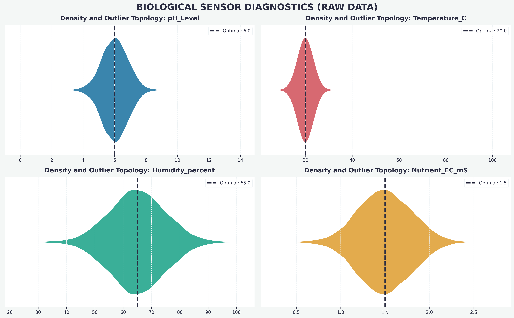
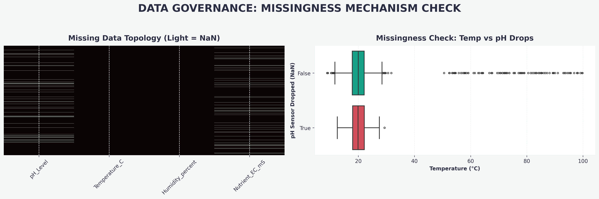
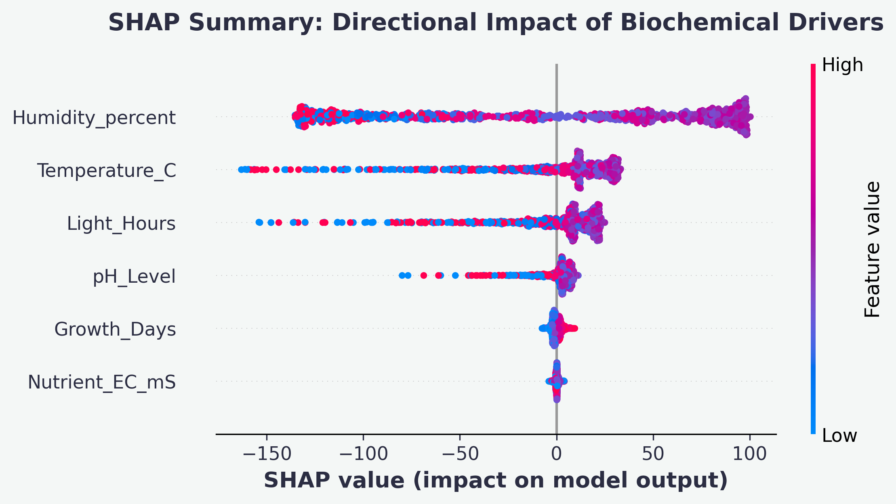
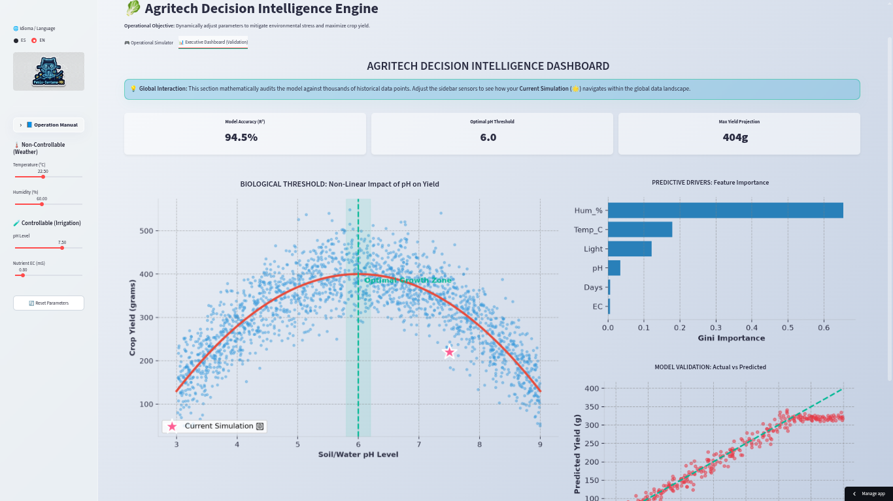

<div align="center">
  <h1>🥬 Agritech Decision Intelligence Engine</h1>
  <p><i>End-to-End Decision Intelligence: From Raw Sensor Data to Mathematical Optimization</i></p>

  <p>
    <a href="#-english-version">🇬🇧 English Version</a> | <a href="#-versión-en-español">🇲🇽 Versión en Español</a>
  </p>

  <a href="https://agritech-decision-engine.streamlit.app/">
    
  </a>
  
  
  
</div>

---

# 🇬🇧 English Version

## 🔬 Abstract / Executive Summary
Modern hydroponic systems generate dense streams of IoT telemetry data, yet the agribusiness sector frequently fails to utilize this information prescriptively. The yield of *Lactuca sativa* (lettuce) suffers a severe non-linear biological decline when the environment deviates from its tolerance threshold. 

This project applies the **Scientific Method** to mathematically model these biochemical interactions. We transition from sensor anomaly imputation, through the training of decision tree ensembles (Random Forest) with Explainable AI (SHAP), culminating in a heuristic optimization engine that prescribes real-time calibrations to maximize yield.

---

## 🧪 Scientific Methodology & Experimentation

### Phase 1: Descriptive Analysis & Data Topology
Prior to any modeling, 4,900 telemetry records were audited to evaluate data quality and isolate the distribution of biochemical and climatic variables.

<div align="center">
  
</div>
<br>

> **Fig 1. Density and Outlier Topology:** Violin analysis reveals the density distribution of the sensors. The operational "sweet spot" (e.g., pH Level at 6.0) was mathematically isolated. Values escaping this threshold cause a collapse in plant biomass.

<div align="center">
  
</div>
<br>

> **Fig 2. Data Governance (Missingness Mechanisms):** The topological heatmap and bivariate analysis detected a non-random pattern in data loss: the pH sensor tends to fail systematically when the temperature exceeds 30°C (environmental stress). This relationship was imputed using multivariate techniques to prevent the massive discarding of critical records.

---

### Phase 2: Predictive Modeling & Explainable AI (XAI)
Given the parabolic nature of biological processes, the baseline Linear Regression model failed due to underfitting, with an **R² of only 0.0019** and a massive error of **100.3g (RMSE)**. This justified the evolution to a non-linear ensemble algorithm: `Random Forest Regressor`.

<div align="center">
  
</div>
<br>

> **Fig 3. Explainable Artificial Intelligence (SHAP):** While Gini impurity only indicates *what* variable matters, SHAP reveals the *directionality* of the causal impact. The summary confirms that high temperatures (red dots on the left) heavily penalize yield, whereas maintaining electroconductivity (Nutrients) and pH in precise thresholds (right clustering) are the main drivers to maximize the harvest.

---

### Phase 3: Prescriptive Analytics (Heuristic Optimization Engine)
Understanding the biological drop is not enough. An Optimization Engine (*Heuristic Grid Search*) was built to ingest the serialized `Random Forest` object.
*   **Mathematical Mechanism:** The engine freezes uncontrollable variables in real-time (Weather: Temperature, Humidity) and iterates over a simulation hyperplane of controllable variables (Irrigation Levers: pH and EC). 
*   **Automatic Decision:** Extracts the `argmax` (combination that maximizes yield) in milliseconds, prescribing the exact commands the operator must input into mechanical actuators to rescue the plant under stress.

---

## 📊 Deployment (Interactive Digital Twin)
The entire analytical pipeline was packaged into a rich interface application (`Streamlit` injected with *Theme-Aware Glassmorphism CSS*). It is divided into two main operational tabs:

*   **Tab 1 - Operational Simulator:** Allows non-technical stakeholders to input current greenhouse sensor data and instantly evaluate plant health through reactive visual indicators, receiving precise actuator commands (e.g., "Adjust pH to 6.0").
*   **Tab 2 - Executive Dashboard (Real-Time Audit):** Recreates the mathematical validation of the model. The "Biological Threshold" scatter plot is fully interactive. As the user modifies the simulation parameters in the sidebar, a dynamic star marker (🌟) navigates through the historical data landscape. **This star represents the exact real-time projection of the current state, due to the modification of the simulation parameters**, allowing the stakeholder to visually audit how far their current crop state deviates from the absolute mathematical optimum.

<div align="center">
  
  <br><br>
  <a href="https://agritech-decision-engine.streamlit.app/">
    
  </a>
</div>
<br>

## 🚀 Reproducibility
To audit the research in a local environment and run the source code:

1. Clone this repository.
2. Build the isolated environment by installing dependencies:
   ```bash
   pip install -r requirements.txt
   ```
3. Run the Prescriptive Engine:
   ```bash
   streamlit run app.py
   ```

---
<br>

# 🇲🇽 Versión en Español

## 🔬 Abstract / Resumen Ejecutivo
Los sistemas hidropónicos modernos generan densos flujos de datos telemétricos (IoT), pero la agroindustria frecuentemente falla en utilizar esta información de forma prescriptiva. El rendimiento de la *Lactuca sativa* (lechuga) sufre una caída biológica no lineal severa cuando el entorno se aleja de su umbral de tolerancia. 

Este proyecto aplica el **Método Científico** para modelar matemáticamente estas interacciones bioquímicas. Transicionamos desde la imputación de anomalías en sensores, pasando por el entrenamiento de ensambles de árboles de decisión (Random Forest) con Inteligencia Artificial Explicable (SHAP), hasta culminar en un motor de optimización heurística que receta calibraciones en tiempo real para maximizar el rendimiento.

---

## 🧪 Metodología y Experimentación Científica

### Fase 1: Análisis Descriptivo y Topología de Datos
Antes de cualquier modelado, se auditaron 4,900 registros telemétricos para evaluar la calidad de los datos y aislar la distribución de las variables bioquímicas y climáticas.

<div align="center">
  
</div>
<br>

> **Fig 1. Densidad y Topología de Valores Atípicos:** El análisis de violín revela la distribución de densidad de los sensores. Se aisló matemáticamente el "punto dulce" operativo (ej. Nivel de pH en 6.0). Los valores que se escapan de este umbral generan un colapso en la biomasa de la planta. 

<div align="center">
  
</div>
<br>

> **Fig 2. Gobernanza de Datos (Mecanismos de Missingness):** El mapa de calor topológico y el análisis bivariado detectaron un patrón no aleatorio en la pérdida de datos: el sensor de pH tiende a fallar sistemáticamente cuando la temperatura excede los 30°C (condición de estrés). Esta relación se imputó mediante técnicas multivariadas para evitar el descarte masivo de registros críticos.

---

### Fase 2: Modelado Predictivo e Inteligencia Explicable (XAI)
Dada la naturaleza parabólica de los procesos biológicos, el modelo base de Regresión Lineal falló por subajuste (*Underfitting*), con un **R² de apenas 0.0019** y un error masivo de **100.3g (RMSE)**. Esto justificó la evolución a un ensamble no lineal: `Random Forest Regressor`.

<div align="center">
  
</div>
<br>

> **Fig 3. Inteligencia Artificial Explicable (SHAP):** Mientras que la impureza de Gini solo indica *qué* variable importa, SHAP revela la *direccionalidad* del impacto causal. El resumen confirma que temperaturas altas (puntos rojos a la izquierda) penalizan fuertemente el rendimiento, mientras que mantener la electroconductividad (Nutrientes) y el pH en umbrales precisos (clustering derecho) son los motores principales para maximizar la cosecha.

---

### Fase 3: Analítica Prescriptiva (Motor de Optimización Heurística)
Conocer la caída biológica no es suficiente. Se construyó un Motor de Optimización (*Heuristic Grid Search*) que ingiere el objeto `Random Forest` serializado. 
*   **Mecanismo Matemático:** El motor congela las variables incontrolables en tiempo real (Clima: Temperatura, Humedad) e itera sobre un hiperplano de simulación de las variables controlables (Palancas de Riego: pH y EC). 
*   **Decisión Automática:** Extrae el `argmax` (combinación que maximiza el rendimiento) en milisegundos, prescribiendo los comandos exactos que el operador debe introducir en los actuadores mecánicos para rescatar la planta bajo estrés.

---

## 📊 Despliegue (Gemelo Digital Interactivo)
Todo el pipeline analítico se empaquetó en una aplicación de interfaz rica (`Streamlit` con inyección de *Glassmorphism CSS Theme-Aware*). Se divide en dos pestañas principales:

*   **Pestaña 1 - Simulador Operativo:** Permite a *stakeholders* sin perfil técnico ingresar datos del invernadero y evaluar instantáneamente la salud absoluta del cultivo a través de indicadores visuales reactivos, recibiendo comandos de actuación precisos (ej. "Ajustar pH a 6.0").
*   **Pestaña 2 - Executive Dashboard (Auditoría en Tiempo Real):** Recrea la validación matemática del modelo. El gráfico de dispersión del "Umbral Biológico" es completamente interactivo. Conforme el usuario modifica los parámetros de simulación en la barra lateral, un marcador dinámico en forma de estrella (🌟) navega por el panorama de datos históricos. **Esta estrella representa la proyección exacta en tiempo real del estado actual, debido a la modificación de los parámetros de simulación**, permitiendo al usuario auditar visualmente qué tan lejos se encuentra su cultivo del óptimo matemático global.

<div align="center">
  
  <br><br>
  <a href="https://agritech-decision-engine.streamlit.app/">
    
  </a>
</div>
<br>

## 🚀 Reproducibilidad del Experimento
Para auditar la investigación en un entorno local y ejecutar el código fuente:

1. Clonar el repositorio.
2. Construir el entorno aislado instalando las dependencias:
   ```bash
   pip install -r requirements.txt
   ```
3. Ejecutar el motor prescriptivo:
   ```bash
   streamlit run app.py
   ```

---

## 📬 Contact & Research Profile / Contacto y Perfil

**Pablo Alberto Santana Flores**
*Data Scientist | Decision Intelligence | PhD in Marine Sciences*

Especializado en resolver problemas de negocio complejos mediante arquitecturas de datos modernas (Machine Learning, Optimization Engines, MLOps). Abierto a proyectos de alto impacto (Data Analyst, Data Scientist, Operaciones).

*   💼 **LinkedIn:** [linkedin.com/in/pablo-santana-mx](https://mx.linkedin.com/in/pablo-santana-mx)
*   🐙 **GitHub:** [github.com/Pablo-Santana-MX](https://github.com/Pablo-Santana-MX)
*   ✉️ **Email:** [pablo.santana@outlook.com](mailto:pablo.santana@outlook.com)
