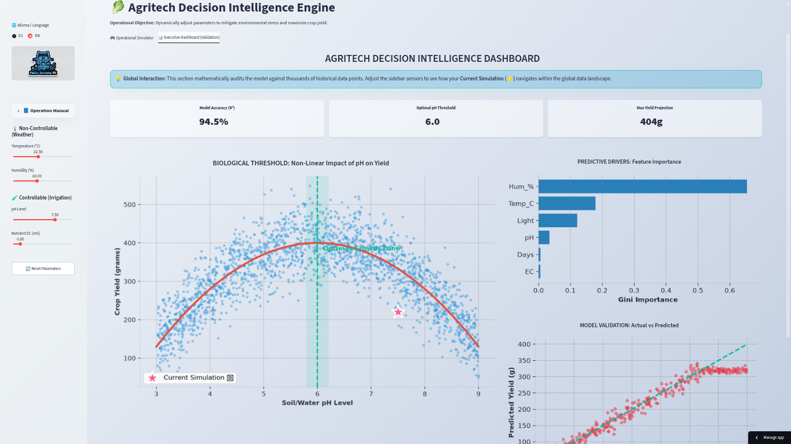
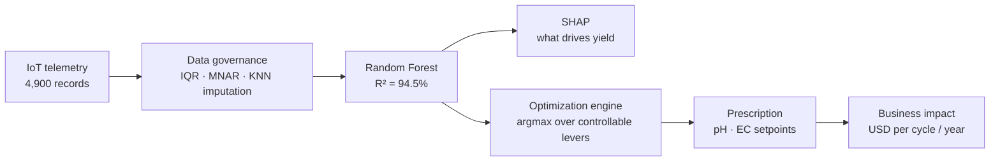
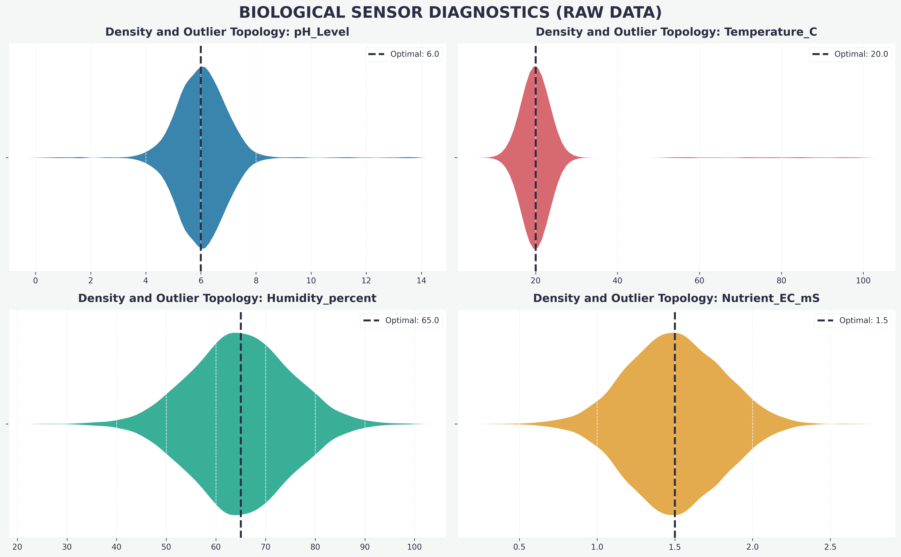
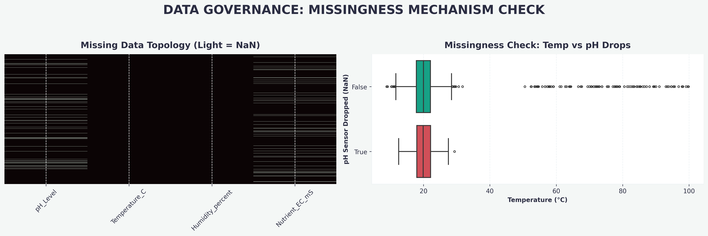
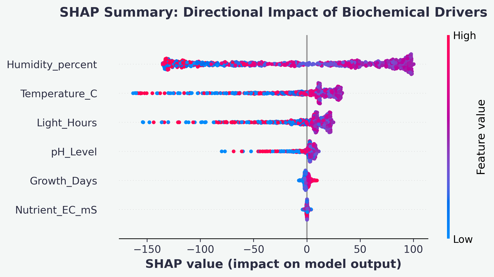
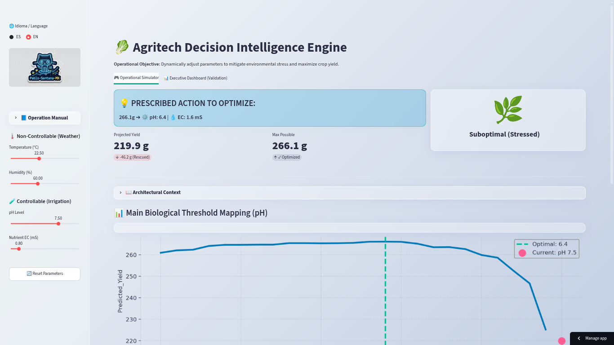
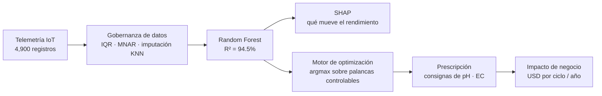

<div align="center">

  <p><sub><b>S-LABS · ADVANCED DATA SOLUTIONS</b> &nbsp;|&nbsp; Data Science & Decision Intelligence</sub></p>

  <h1>Agritech Decision Intelligence Engine</h1>
  <p><i>From raw sensor data to a prescribed action and its dollar value.🥬</i></p>

  <p>
    <a href="#-english-version">🇬🇧 English Version</a> &nbsp;|&nbsp; <a href="#-versión-en-español">🇲🇽 Versión en Español</a>
  </p>

  <a href="https://agritech-decision-engine.streamlit.app/">
    
  </a>
  
  
  
  

  <br><br>
  <a href="https://agritech-decision-engine.streamlit.app/">
    
  </a>
</div>

---

# 🇬🇧 English Version

## ⚡ At a Glance

| | |
|---|---|
| **The problem** | Hydroponic operations collect dense IoT telemetry, but rarely turn it into prescriptive decisions. Lettuce yield (*Lactuca sativa*) collapses non-linearly when conditions drift from their tolerance thresholds. |
| **The solution** | A pipeline that goes from data governance to a Random Forest with explainability (SHAP), and then to an optimization engine that prescribes the **exact pH and EC setpoints** for the current climate. |
| **The evidence** | 4,900 telemetry records · Linear baseline R² = 0.0019 → Random Forest **R² = 94.5%** · SHAP attribution for every driver. |
| **The business layer** | The prescription is translated into **revenue recovered per cycle and per year**, and separates what irrigation can fix from what is climate-bound. |
| **The audience** | C-level (ROI, recoverable value) and greenhouse operators (clear setpoints, no math required). |

---

## 🧭 From Data to Decision


```mermaid
flowchart LR
    A["IoT telemetry<br/>4,900 records"] --> B["Data governance<br/>IQR · MNAR · KNN imputation"]
    B --> C["Random Forest<br/>R² = 94.5%"]
    C --> D["SHAP<br/>what drives yield"]
    C --> E["Optimization engine<br/>argmax over controllable levers"]
    E --> F["Prescription<br/>pH · EC setpoints"]
    F --> G["Business impact<br/>USD per cycle / year"]
```

---

## 🧪 Scientific Methodology & Theoretical Framework

### Phase 1: Descriptive Analysis & Data Topology
Before any modeling, 4,900 telemetry records were audited for quality.

**Theoretical Framework (Descriptive Statistics):**
To isolate the operational "sweet spots", Kernel Density Estimation (KDE) was used to map the probability density of the continuous variables. Outliers indicating sensor failure were isolated with the Interquartile Range ($IQR$) method: any point outside $[Q_1 - 1.5 \times IQR,\; Q_3 + 1.5 \times IQR]$ was flagged for multivariate imputation.

<div align="center">
  
</div>
<br>

> **Fig 1. Density and Outlier Topology:** Violin analysis reveals the density distribution of each sensor, capturing the bi-modal or skewed nature of biological parameters. The optimal growth threshold (e.g., pH 6.0) was isolated from the data.

<div align="center">
  
</div>
<br>

> **Fig 2. Data Governance (Missingness Mechanisms):** Bivariate analysis detected a *Missing Not At Random* (MNAR) pattern: the pH sensor fails systematically when temperature exceeds 30 °C. The gap was imputed with KNN-based techniques rather than dropped, so the stress regime, where decisions matter most, stays in the training data.

---

### Phase 2: Predictive Modeling & Explainable AI (XAI)
Given the parabolic nature of biological processes, the baseline Linear Regression failed through severe underfitting ($R^2 = 0.0019$), which justified a non-linear ensemble.

**Theoretical Framework (Random Forest Regressor):**
The algorithm builds $B$ decision trees. For an input vector $x$, the predicted yield $\hat{y}$ is the average of all individual tree predictions $T_b(x)$:

$$\hat{y} = \frac{1}{B} \sum_{b=1}^{B} T_b(x)$$

Averaging reduces model variance and captures the biological thresholds, reaching a final **Coefficient of Determination of $R^2$ = 94.5%**.

<div align="center">
  
</div>
<br>

> **Fig 3. Explainable AI (SHAP):** Impurity-based importance only says *which* variable matters. SHAP values (from cooperative game theory) also show the *direction* of each variable's contribution to the model's prediction: high temperatures push predicted yield down, while holding pH inside its threshold is the main driver of yield. SHAP explains the model's behavior; it is an attribution, not proof of causality.

---

### Phase 3: Prescriptive Analytics (Heuristic Optimization Engine)
Knowing where the biological drop happens is not enough; the decision has to be automated.

<div align="center">
  
</div>
<br>

> **Fig 4. Architectural Pipeline:** The serialized Random Forest acts as the "brain". The engine injects live sensor readings, simulates the candidate scenarios, and returns an operational prescription.

**Theoretical Framework (Heuristic Grid Search Formulation):**
Let $f(X)$ be the trained model predicting yield. Features are split into uncontrollable environmental variables $E$ (temperature, humidity) and controllable levers $C$ (pH, EC). The engine solves, in real time:

$$C^* = \arg\max_{C \in S} f(E_{current}, C)$$

where $S$ is the operational boundary of the actuators.

* **Mechanism:** the engine freezes $E$ and evaluates a hyper-grid over $C$ (pH 4.0–9.0 and EC 0.5–3.0 mS at 0.1 resolution, 1,326 candidates).
* **Decision:** it extracts $C^*$ (`argmax`) in milliseconds and prescribes the exact adjustment (e.g., "Set pH to 6.0") that rescues the crop from stress.

<div align="center">
  
</div>
<br>

> **Fig 5. Prescriptive Simulator:** The interface outputs the computed vector $C^*$ with the required adjustment, turning the math into a simple instruction for the operator.

---

## 💼 Business Impact Layer

A prescription only matters if it can be priced. The simulator converts the yield gain into money using three editable assumptions (selling price per kg, plants in production, cycles per year) and splits the yield gap into three parts:

| Segment | Meaning |
|---|---|
| **Captured today** | Revenue at current telemetry. |
| **Recoverable via calibration** | Value unlocked by moving pH and EC to $C^*$. This is the actionable part. |
| **Climate-limited** | Remaining distance to the theoretical ceiling. It depends on temperature and humidity, and irrigation cannot recover it. |

**Illustrative example** (simulated response surface; assumptions: 10,000 plants, USD 6/kg, 6 cycles/year; not a performance guarantee):

| Scenario | Yield today → calibrated | Recoverable per cycle | Annualized |
|---|---|---|---|
| Default telemetry (T 22.5 °C, pH 7.5, EC 0.8) | 282 g → 397 g per plant | ≈ USD 6.9k | ≈ USD 41k |
| 🚨 Critical stress (T 34 °C, pH 4.8, EC 2.8) | 80 g → 222 g per plant | ≈ USD 8.5k | ≈ USD 51k |

---

## 📊 Deployment (Interactive Digital Twin)
The analytical pipeline is packaged as a `Streamlit` application.

* **Tab 1 · Operational Simulator:** prescription card (pH, EC, target yield and required adjustment), crop health index, yield KPIs, financial impact, the pH response curve, and a sensor sensitivity audit with color + icon status.
* **Tab 2 · Executive Dashboard:** tells the validation story in three steps: **the problem** (non-linear value loss around the optimal pH), **the lever** (controllable vs. uncontrollable drivers) and **the trust** (predicted vs. actual, with R² and MAE). The star marker (🌟) is the real-time projection of the current state on the historical data landscape, so users can audit visually how far the crop is from the global optimum.

**Engineering decisions**

* **Accessible by design:** Okabe-Ito palette (color-blind safe); every status pairs color, icon and text.
* **Native light/dark mode** and a responsive layout.
* **Fully bilingual (ES/EN)**, with every string in a single dictionary.
* **Fast:** vectorized inference and cached computations; sliders do not recompute what was already evaluated.
* **Honest degradation:** if the serialized model or a real hold-out is not bundled, the app runs on a simulated surrogate and shows a visible **DEMO** badge and a synthetic-data notice. It never presents simulated validation as real.

<div align="center">
  <br>
  <a href="https://agritech-decision-engine.streamlit.app/">
    
  </a>
</div>

---

## ⚠️ Limitations & Responsible Use

* **Association, not causation.** The data are observational. SHAP and the optimizer describe the model's learned response, which should be validated with controlled trials before critical changes.
* **Extrapolation risk.** Tree ensembles do not extrapolate beyond the range seen in training; prescriptions near the edges of $S$ deserve extra caution.
* **Climate held fixed.** $E$ is treated as constant during the decision; fast weather shifts require re-running the engine.
* **Economics are assumption-driven.** The financial layer uses editable inputs and does not yet include nutrient or labor costs.
* **Scope.** Calibrated for hydroponic lettuce; other crops require retraining and revalidation.

---

## 🚀 Reproducibility

```bash
git clone https://github.com/Pablo-Santana-MX/agritech-decision-engine.git
cd agritech-decision-engine
python -m venv .venv && source .venv/bin/activate    # Windows: .venv\Scripts\activate
pip install -r requirements.txt                      # streamlit>=1.50, numpy, pandas, matplotlib, joblib, pillow, scikit-learn
streamlit run app.py
```

Optional plug-ins (detected automatically):

| File | Effect |
|---|---|
| `models/rf_yield_predictor.pkl` | Uses your trained model instead of the simulated surrogate (the DEMO badge disappears). It must accept a DataFrame with columns `Temperature_C, Humidity_percent, pH_Level, Nutrient_EC_mS, Light_Hours, Growth_Days`. |
| `data/validation_holdout.csv` | Uses a real hold-out for the dashboard metrics. Columns: the six features plus `Actual_Yield`. |
| `logo_git.png` | Shows your logo in the sidebar. |

## 🗺️ Roadmap

- [ ] Prediction intervals (quantile forests or conformal prediction) to show the risk of each prescription.
- [ ] Cost-aware objective: maximize *margin* (revenue minus nutrient cost), not only yield.
- [ ] Actuator rate-of-change constraints for smooth, safe adjustments.
- [ ] Drift monitoring and a prescription API for integration with greenhouse controllers.

---

## 🤝 Work with S-Labs

This project is a working example of how **S-Labs** approaches decision intelligence: rigorous modeling, explainability, and a clear line to business value. If your operation has telemetry and decisions that cost money, we can build this for your case.

**Pablo Alberto Santana Flores**
*Data Scientist | Decision Intelligence | PhDc in Marine Sciences*

* 💼 **LinkedIn:** [linkedin.com/in/pablo-santana-mx](https://mx.linkedin.com/in/pablo-santana-mx)
* 🐙 **GitHub:** [github.com/Pablo-Santana-MX](https://github.com/Pablo-Santana-MX)
* ✉️ **Email:** [pablo.santana@outlook.com](mailto:pablo.santana@outlook.com)

---
<br>

# 🇲🇽 Versión en Español

## ⚡ De un vistazo

| | |
|---|---|
| **El problema** | Las operaciones hidropónicas generan telemetría IoT densa, pero rara vez la convierten en decisiones prescriptivas. El rendimiento de la lechuga (*Lactuca sativa*) cae de forma no lineal cuando las condiciones se alejan de sus umbrales de tolerancia. |
| **La solución** | Un pipeline que va de la gobernanza de datos a un Random Forest con explicabilidad (SHAP) y de ahí a un motor de optimización que prescribe **los valores exactos de pH y EC** para el clima actual. |
| **La evidencia** | 4,900 registros de telemetría · Línea base lineal R² = 0.0019 → Random Forest **R² = 94.5%** · atribución SHAP de cada variable. |
| **La capa de negocio** | La prescripción se traduce a **ingreso recuperado por ciclo y por año**, y separa lo que el riego puede corregir de lo que depende del clima. |
| **La audiencia** | Directivos (ROI, valor recuperable) y operadores de invernadero (consignas claras, sin necesidad de matemáticas). |

---

## 🧭 De los Datos a la Decisión


```mermaid
flowchart LR
    A["Telemetría IoT<br/>4,900 registros"] --> B["Gobernanza de datos<br/>IQR · MNAR · imputación KNN"]
    B --> C["Random Forest<br/>R² = 94.5%"]
    C --> D["SHAP<br/>qué mueve el rendimiento"]
    C --> E["Motor de optimización<br/>argmax sobre palancas controlables"]
    E --> F["Prescripción<br/>consignas de pH · EC"]
    F --> G["Impacto de negocio<br/>USD por ciclo / año"]
```

---

## 🧪 Metodología, Experimentación y Marco Teórico

### Fase 1: Análisis Descriptivo y Topología de Datos
Se auditaron 4,900 registros telemétricos para evaluar la calidad de los datos.

**Marco Teórico (Estadística Descriptiva):**
Para aislar los umbrales operativos se utilizó Estimación de Densidad de Kernel (KDE) y así mapear la densidad de probabilidad de las variables continuas. Las anomalías de los sensores se detectaron con el Rango Intercuartílico ($IQR$): cualquier punto fuera de $[Q_1 - 1.5 \times IQR,\; Q_3 + 1.5 \times IQR]$ se marcó para imputación multivariada.

<div align="center">
  
</div>
<br>

> **Fig 1. Densidad y Topología:** El análisis de violín revela la distribución de cada sensor y captura la naturaleza bimodal o sesgada de los parámetros biológicos. Se aisló a partir de los datos el "punto dulce" operativo (p. ej., pH 6.0).

<div align="center">
  
</div>
<br>

> **Fig 2. Gobernanza de Datos:** El análisis bivariado detectó un patrón de pérdida no aleatorio (*MNAR*): el sensor de pH falla de forma sistemática con temperaturas superiores a 30 °C. El hueco se imputó con técnicas basadas en KNN en lugar de descartarlo, de modo que el régimen de estrés, donde las decisiones más importan, permanece en el entrenamiento.

---

### Fase 2: Modelado Predictivo e Inteligencia Explicable (XAI)
Dada la naturaleza parabólica de los procesos biológicos, la Regresión Lineal base falló por subajuste severo ($R^2 = 0.0019$), lo que justificó un ensamble no lineal.

**Marco Teórico (Random Forest Regressor):**
El algoritmo construye $B$ árboles de decisión. Para un vector de entrada $x$, el rendimiento predicho $\hat{y}$ es el promedio de las predicciones individuales $T_b(x)$:

$$\hat{y} = \frac{1}{B} \sum_{b=1}^{B} T_b(x)$$

El promedio reduce la varianza del modelo y captura los umbrales biológicos, con un **Coeficiente de Determinación final de $R^2$ = 94.5%**.

<div align="center">
  
</div>
<br>

> **Fig 3. IA Explicable (SHAP):** La importancia por impureza solo indica *qué* variable importa. Los valores SHAP (de la teoría de juegos cooperativos) muestran además la *dirección* de la contribución de cada variable a la predicción del modelo: las temperaturas altas empujan el rendimiento predicho a la baja, y mantener el pH dentro de su umbral es el principal motor del rendimiento. SHAP explica el comportamiento del modelo; es una atribución, no una prueba de causalidad.

---

### Fase 3: Analítica Prescriptiva (Motor de Optimización Heurística)
Conocer dónde ocurre la caída biológica no basta; la decisión debe automatizarse.

<div align="center">
  
</div>
<br>

> **Fig 4. Flujo Arquitectónico:** El Random Forest serializado actúa como el "cerebro". El motor inyecta lecturas de sensores en vivo, simula los escenarios candidatos y devuelve una prescripción operativa.

**Marco Teórico (Formulación de Grid Search Heurístico):**
Sea $f(X)$ el modelo entrenado que predice el rendimiento. Las variables se dividen en ambientales incontrolables $E$ (temperatura, humedad) y palancas controlables $C$ (pH, EC). El motor resuelve, en tiempo real:

$$C^* = \arg\max_{C \in S} f(E_{actual}, C)$$

donde $S$ es el límite operativo de los actuadores.

* **Mecanismo:** el motor congela $E$ y evalúa una hiper-rejilla sobre $C$ (pH 4.0–9.0 y EC 0.5–3.0 mS con resolución de 0.1, 1,326 candidatos).
* **Decisión:** extrae $C^*$ (`argmax`) en milisegundos y prescribe el ajuste exacto (p. ej., "Ajustar pH a 6.0") que rescata el cultivo bajo estrés.

<div align="center">
  
</div>
<br>

> **Fig 5. Simulador Prescriptivo:** La interfaz entrega el vector $C^*$ calculado con el ajuste requerido, y traduce las matemáticas en una instrucción simple para el operador.

---

## 💼 Capa de Impacto de Negocio

Una prescripción solo importa si se le puede poner precio. El simulador convierte la ganancia de rendimiento en dinero con tres supuestos editables (precio de venta por kg, plantas en producción y ciclos por año) y divide la brecha de rendimiento en tres partes:

| Segmento | Significado |
|---|---|
| **Capturado hoy** | Ingreso con la telemetría actual. |
| **Recuperable con calibración** | Valor que se libera al llevar pH y EC a $C^*$. Es la parte accionable. |
| **Limitado por clima** | Distancia restante al techo teórico. Depende de temperatura y humedad, y el riego no puede recuperarla. |

**Ejemplo ilustrativo** (superficie de respuesta simulada; supuestos: 10,000 plantas, USD 6/kg, 6 ciclos/año; no es una garantía de desempeño):

| Escenario | Rendimiento hoy → calibrado | Recuperable por ciclo | Anualizado |
|---|---|---|---|
| Telemetría por defecto (T 22.5 °C, pH 7.5, EC 0.8) | 282 g → 397 g por planta | ≈ USD 6.9k | ≈ USD 41k |
| 🚨 Estrés crítico (T 34 °C, pH 4.8, EC 2.8) | 80 g → 222 g por planta | ≈ USD 8.5k | ≈ USD 51k |

---

## 📊 Despliegue (Gemelo Digital Interactivo)
Todo el pipeline se empaquetó en una aplicación `Streamlit`.

* **Pestaña 1 · Simulador Operativo:** tarjeta de prescripción (pH, EC, rendimiento objetivo y ajuste requerido), índice de salud del cultivo, KPIs de rendimiento, impacto financiero, la curva de respuesta al pH y una auditoría de sensibilidad de sensores con estado en color e ícono.
* **Pestaña 2 · Dashboard Ejecutivo:** cuenta la validación en tres pasos: **el problema** (pérdida de valor no lineal alrededor del pH óptimo), **la palanca** (variables controlables vs. no controlables) y **la confianza** (predicho vs. real, con R² y MAE). El marcador de estrella (🌟) es la proyección en tiempo real del estado actual sobre el panorama de datos históricos, y permite auditar visualmente qué tan lejos está el cultivo del óptimo global.

**Decisiones de ingeniería**

* **Accesible por diseño:** paleta Okabe-Ito (apta para daltonismo); cada estado combina color, ícono y texto.
* **Modo claro/oscuro nativo** y diseño responsivo.
* **Totalmente bilingüe (ES/EN)**, con todas las cadenas en un único diccionario.
* **Rápida:** inferencia vectorizada y cálculos en caché; los sliders no recalculan lo que ya se evaluó.
* **Degradación honesta:** si no se incluye el modelo serializado o un hold-out real, la app corre sobre un sustituto simulado y muestra una insignia **DEMO** visible y un aviso de datos sintéticos. Nunca presenta una validación simulada como real.

<div align="center">
  <br>
  <a href="https://agritech-decision-engine.streamlit.app/">
    
  </a>
</div>

---

## ⚠️ Limitaciones y Uso Responsable

* **Asociación, no causalidad.** Los datos son observacionales. SHAP y el optimizador describen la respuesta aprendida por el modelo, que conviene validar con ensayos controlados antes de cambios críticos.
* **Riesgo de extrapolación.** Los ensambles de árboles no extrapolan más allá del rango visto en entrenamiento; las prescripciones cerca de los bordes de $S$ requieren cautela adicional.
* **Clima fijo.** $E$ se trata como constante durante la decisión; cambios rápidos del clima exigen volver a ejecutar el motor.
* **La economía depende de supuestos.** La capa financiera usa entradas editables y aún no incluye costos de nutrientes ni de mano de obra.
* **Alcance.** Calibrado para lechuga hidropónica; otros cultivos requieren reentrenar y revalidar.

---

## 🚀 Reproducibilidad

```bash
git clone https://github.com/Pablo-Santana-MX/agritech-decision-engine.git
cd agritech-decision-engine
python -m venv .venv && source .venv/bin/activate    # Windows: .venv\Scripts\activate
pip install -r requirements.txt                      # streamlit>=1.50, numpy, pandas, matplotlib, joblib, pillow, scikit-learn
streamlit run app.py
```

Complementos opcionales (se detectan automáticamente):

| Archivo | Efecto |
|---|---|
| `models/rf_yield_predictor.pkl` | Usa tu modelo entrenado en lugar del sustituto simulado (la insignia DEMO desaparece). Debe aceptar un DataFrame con las columnas `Temperature_C, Humidity_percent, pH_Level, Nutrient_EC_mS, Light_Hours, Growth_Days`. |
| `data/validation_holdout.csv` | Usa un hold-out real para las métricas del dashboard. Columnas: las seis variables más `Actual_Yield`. |
| `logo_git.png` | Muestra tu logo en la barra lateral. |

## 🗺️ Hoja de Ruta

- [ ] Intervalos de predicción (bosques cuantílicos o predicción conforme) para mostrar el riesgo de cada prescripción.
- [ ] Objetivo sensible a costos: maximizar el *margen* (ingreso menos costo de nutrientes), no solo el rendimiento.
- [ ] Restricciones de velocidad de cambio de los actuadores para ajustes suaves y seguros.
- [ ] Monitoreo de deriva y una API de prescripción para integrarse con controladores de invernadero.

---

## 🤝 Trabaja con S-Labs

Este proyecto es un ejemplo funcional de cómo **S-Labs** aborda la inteligencia de decisiones: modelado riguroso, explicabilidad y una línea clara hacia el valor de negocio. Si tu operación tiene telemetría y decisiones que cuestan dinero, podemos construir esto para tu caso.

**Pablo Alberto Santana Flores**
*Científico de Datos | Inteligencia de Decisiones | PhDc en Ciencias Marinas*

* 💼 **LinkedIn:** [linkedin.com/in/pablo-santana-mx](https://mx.linkedin.com/in/pablo-santana-mx)
* 🐙 **GitHub:** [github.com/Pablo-Santana-MX](https://github.com/Pablo-Santana-MX)
* ✉️ **Email:** [pablo.santana@outlook.com](mailto:pablo.santana@outlook.com)